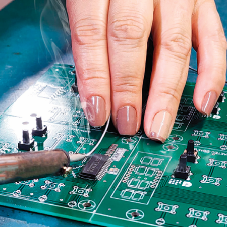

# Anotações

## Estrutura sessão "Sobre"

    <section id="sobre">
        

            

                
            

            

                <h3>Sobre nós</h3>
                

                    A Baetec é uma empresa líder no setor de desenvolvimento e fabricação de equipamentos eletrônicos de Maringá e região, com uma sólida trajetória de mais de 19 anos no mercado, atendendo todas as regiões do Brasil. 
                     
                    Dedicamo-nos constantemente à pesquisa, estudo e desenvolvimento de soluções práticas nas áreas de Automação Residencial, Industrial e Automotiva. Nosso principal objetivo é criar soluções que atendam às necessidades específicas de cada cliente, visando proporcionar segurança, eficiência e confiabilidade. 
                     
                    Além disso, a Baetec oferece programas de capacitação em instituições de ensino técnico e superior, bem como treinamentos internos para nossos colaboradores, garantindo que nossa equipe esteja sempre atualizada com as mais recentes inovações tecnológicas. 
                     
                    Nossos produtos com a marca Baetec são conhecidos por sua durabilidade, segurança e economia, respaldados por garantia total em todos os itens que fabricamos. Valorizamos a aplicação da mais recente tecnologia para garantir a máxima qualidade, funcionalidade e praticada de, mantendo nosso compromisso constante com a inovação, tudo isso visando oferecer o melhor custo-benefício do mercado
                

            

        

    </section>
